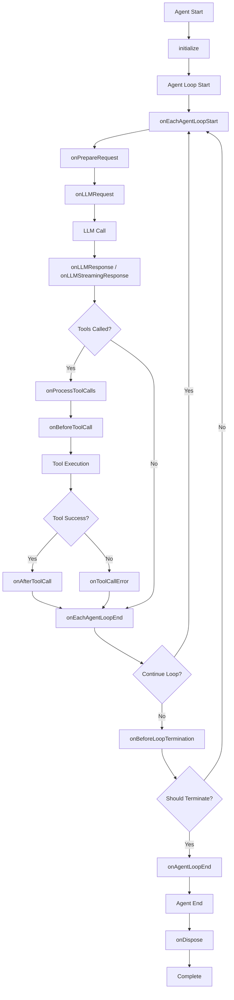

# Agent Hooks

## Introduction

Agent Hooks provide a powerful way to extend and customize the behavior of your Agents throughout their execution lifecycle. The `BaseAgent` class exposes a comprehensive set of hooks that allow you to intercept, modify, and react to various events during Agent execution.

## Overview

| Hook | Description |
|------|-------------|
| [`initialize()`](#initialize) | Called during Agent initialization |
| [`onDispose()`](#ondispose) | Called during Agent disposal |
| [`onPrepareRequest()`](#onpreparerequest) | Before preparing LLM request |
| [`onLLMRequest()`](#onllmrequest) | Before sending request to LLM |
| [`onLLMResponse()`](#onllmresponse) | After receiving response from LLM |
| [`onLLMStreamingResponse()`](#onllmstreamingresponse) | For streaming responses from LLM |
| [`onProcessToolCalls()`](#onprocesstoolcalls) | Intercept tool call processing |
| [`onBeforeToolCall()`](#onbeforetoolcall) | Before executing a tool |
| [`onAfterToolCall()`](#onaftertoolcall) | After executing a tool |
| [`onToolCallError()`](#ontooolcallerror) | When tool execution fails |
| [`onEachAgentLoopStart()`](#oneachagentloopstart) | Start of each Agent loop iteration |
| [`onEachAgentLoopEnd()`](#oneachagentloopend) | End of each Agent loop iteration |
| [`onBeforeLoopTermination()`](#onbeforelooptermination) | Before Agent loop terminates |
| [`onAgentLoopEnd()`](#onagentloopend) | When entire Agent loop completes |

## Hooks API

### `initialize()`

Called during Agent initialization to perform setup operations.

```ts
class CustomAgent extends BaseAgent {
  async initialize(): Promise<void> {
    // Perform time-consuming setup operations
    await this.connectToDatabase();
    await this.loadConfiguration();
    console.log('Agent initialized successfully');
  }
}
```

### `onDispose()`

Called during Agent disposal to clean up resources.

```ts
class CustomAgent extends BaseAgent {
  protected async onDispose(): Promise<void> {
    // Clean up resources
    await this.closeConnections();
    this.clearTimers();
    console.log('Agent disposed successfully');
  }
}
```

### `onPrepareRequest()`

Called before preparing the LLM request, allowing dynamic modification of system prompt and tools.

```ts
class CustomAgent extends BaseAgent {
  onPrepareRequest(context: PrepareRequestContext): PrepareRequestResult {
    let { systemPrompt, tools } = context;
    
    // Modify system prompt based on context
    if (context.iteration > 3) {
      systemPrompt += '\n\nNote: You are in iteration ' + context.iteration + 
        '. Please focus on providing a concise final answer.';
    }
    
    // Filter tools based on current state
    const filteredTools = tools.filter(tool => {
      // Disable expensive tools in later iterations
      if (context.iteration > 5 && tool.name.includes('search')) {
        return false;
      }
      return true;
    });
    
    return {
      systemPrompt,
      tools: filteredTools,
    };
  }
}
```

### `onLLMRequest()`

Triggered before sending a request to the LLM, allowing you to inspect or log the request payload.

```ts
class CustomAgent extends BaseAgent {
  async onLLMRequest(id: string, payload: LLMRequestHookPayload): Promise<void> {
    console.log(`Sending request to LLM for session ${id}`);
    console.log(`Model: ${payload.model}`);
    console.log(`Messages: ${payload.messages.length}`);
    
    // Log token usage for monitoring
    this.logTokenUsage(payload);
  }
}
```

### `onLLMResponse()`

Triggered after receiving a response from the LLM, allowing you to process the response.

```ts
class CustomAgent extends BaseAgent {
  async onLLMResponse(id: string, payload: LLMResponseHookPayload): Promise<void> {
    console.log(`Received response for session ${id}`);
    
    // Track response metrics
    this.trackResponseTime(payload.elapsedMs);
    this.trackTokenUsage(payload.usage);
    
    // Custom response processing
    if (payload.response.choices[0]?.finish_reason === 'length') {
      console.warn('Response truncated due to length limit');
    }
  }
}
```

### `onLLMStreamingResponse()`

Triggered for streaming responses from the LLM.

```ts
class CustomAgent extends BaseAgent {
  onLLMStreamingResponse(id: string, payload: LLMStreamingResponseHookPayload): void {
    // Process streaming chunks
    console.log(`Streaming chunk for session ${id}: ${payload.chunk}`);
    
    // Update UI or send real-time updates
    this.updateStreamingUI(payload.chunk);
  }
}
```

### `onProcessToolCalls()`

Intercepts tool call processing, essential for testing and mocking.

```ts
class TestAgent extends BaseAgent {
  onProcessToolCalls(
    id: string,
    toolCalls: ChatCompletionMessageToolCall[]
  ): ToolCallResult[] | undefined {
    // Mock tool calls for testing
    if (this.isTestMode) {
      return toolCalls.map(call => ({
        toolCallId: call.id,
        content: this.getMockResult(call.function.name),
      }));
    }
    
    // Return undefined for normal execution
    return undefined;
  }
}
```

### `onBeforeToolCall()`

Called before executing a tool, allowing you to modify arguments or add validation.

```ts
class CustomAgent extends BaseAgent {
  async onBeforeToolCall(
    id: string,
    toolCall: { toolCallId: string; name: string },
    args: any
  ): Promise<any> {
    console.log(`Executing tool: ${toolCall.name}`);
    
    // Add validation
    if (toolCall.name === 'fileOperation' && !this.hasFilePermission()) {
      throw new Error('Insufficient permissions for file operations');
    }
    
    // Modify arguments
    if (toolCall.name === 'searchWeb') {
      args.maxResults = Math.min(args.maxResults || 10, 5);
    }
    
    return args;
  }
}
```

### `onAfterToolCall()`

Called after executing a tool, allowing you to modify results or add post-processing.

```ts
class CustomAgent extends BaseAgent {
  async onAfterToolCall(
    id: string,
    toolCall: { toolCallId: string; name: string },
    result: any
  ): Promise<any> {
    console.log(`Tool ${toolCall.name} completed`);
    
    // Post-process results
    if (toolCall.name === 'imageAnalysis') {
      result.confidence = this.calculateConfidence(result);
    }
    
    // Log tool usage
    this.logToolUsage(toolCall.name, result);
    
    return result;
  }
}
```

### `onToolCallError()`

Called when a tool execution results in an error, allowing you to handle or transform errors.

```ts
class CustomAgent extends BaseAgent {
  async onToolCallError(
    id: string,
    toolCall: { toolCallId: string; name: string },
    error: any
  ): Promise<any> {
    console.error(`Tool ${toolCall.name} failed:`, error);
    
    // Provide fallback responses
    if (toolCall.name === 'weatherAPI') {
      return 'Weather information is currently unavailable. Please try again later.';
    }
    
    // Transform error messages
    if (error.code === 'RATE_LIMIT') {
      return 'Service is temporarily busy. Please wait a moment and try again.';
    }
    
    return `Error: ${error.message || error}`;
  }
}
```

### `onEachAgentLoopStart()`

Called at the beginning of each Agent loop iteration.

```ts
class CustomAgent extends BaseAgent {
  async onEachAgentLoopStart(sessionId: string): Promise<void> {
    console.log(`Starting loop iteration ${this.getCurrentLoopIteration()} for session ${sessionId}`);
    
    // Inject dynamic context
    this.updateContextForIteration();
    
    // Check resource limits
    if (this.getCurrentLoopIteration() > this.maxIterations * 0.8) {
      console.warn('Approaching maximum iteration limit');
    }
  }
}
```

### `onEachAgentLoopEnd()`

Called at the end of each Agent loop iteration.

```ts
class CustomAgent extends BaseAgent {
  async onEachAgentLoopEnd(context: EachAgentLoopEndContext): Promise<void> {
    console.log(`Completed iteration ${context.iteration} for session ${context.sessionId}`);
    
    // Log iteration metrics
    this.logIterationMetrics(context);
    
    // Check if we should continue
    if (this.shouldTerminateEarly(context)) {
      this.requestLoopTermination();
    }
  }
}
```

### `onBeforeLoopTermination()`

Called before the Agent loop terminates, allowing you to control termination conditions.

```ts
class CustomAgent extends BaseAgent {
  onBeforeLoopTermination(
    id: string,
    finalEvent: AgentEventStream.AssistantMessageEvent
  ): LoopTerminationCheckResult {
    // Ensure specific tools were called
    const requiredTools = ['validateResult', 'saveToDatabase'];
    const calledTools = this.getCalledToolsInSession(id);
    
    const allRequiredToolsCalled = requiredTools.every(tool => 
      calledTools.includes(tool)
    );
    
    if (!allRequiredToolsCalled) {
      console.log('Required tools not called, continuing loop');
      return { finished: false };
    }
    
    // Check response quality
    if (finalEvent.content.length < 50) {
      console.log('Response too short, requesting more detail');
      return { finished: false };
    }
    
    return { finished: true };
  }
}
```

### `onAgentLoopEnd()`

Called when the entire Agent loop completes.

```ts
class CustomAgent extends BaseAgent {
  async onAgentLoopEnd(id: string): Promise<void> {
    console.log(`Agent loop completed for session ${id}`);
    
    // Cleanup session resources
    this.cleanupSession(id);
    
    // Send completion notifications
    await this.notifyCompletion(id);
  }
}
```

## Hook Execution Order


