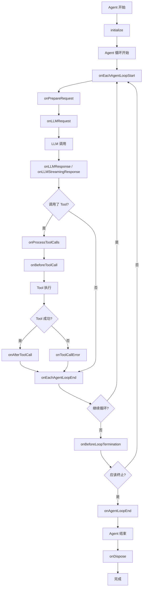

# Agent Hooks

## 介绍

Agent Hooks 提供了一种强大的方式来扩展和自定义 Agent 在整个执行生命周期中的行为。`BaseAgent` 类暴露了一套全面的 hooks，允许你拦截、修改和响应 Agent 执行过程中的各种事件。

## 概览

| Hook | 描述 |
|------|------|
| [`initialize()`](#initialize) | Agent 初始化期间调用 |
| [`onDispose()`](#ondispose) | Agent 销毁期间调用 |
| [`onPrepareRequest()`](#onpreparerequest) | 准备 LLM 请求之前 |
| [`onLLMRequest()`](#onllmrequest) | 向 LLM 发送请求之前 |
| [`onLLMResponse()`](#onllmresponse) | 从 LLM 接收响应之后 |
| [`onLLMStreamingResponse()`](#onllmstreamingresponse) | LLM 流式响应 |
| [`onProcessToolCalls()`](#onprocesstoolcalls) | 拦截 Tool 调用处理 |
| [`onBeforeToolCall()`](#onbeforetoolcall) | 执行 Tool 之前 |
| [`onAfterToolCall()`](#onaftertoolcall) | 执行 Tool 之后 |
| [`onToolCallError()`](#ontooolcallerror) | Tool 执行失败时 |
| [`onEachAgentLoopStart()`](#oneachagentloopstart) | 每个 Agent 循环迭代开始 |
| [`onEachAgentLoopEnd()`](#oneachagentloopend) | 每个 Agent 循环迭代结束 |
| [`onBeforeLoopTermination()`](#onbeforelooptermination) | Agent 循环终止之前 |
| [`onAgentLoopEnd()`](#onagentloopend) | 整个 Agent 循环完成时 |

## Hooks API

### `initialize()`

在 Agent 初始化期间调用，用于执行设置操作。

```ts
class CustomAgent extends BaseAgent {
  async initialize(): Promise<void> {
    // 执行耗时的设置操作
    await this.connectToDatabase();
    await this.loadConfiguration();
    console.log('Agent 初始化成功');
  }
}
```

### `onDispose()`

在 Agent 销毁期间调用，用于清理资源。

```ts
class CustomAgent extends BaseAgent {
  protected async onDispose(): Promise<void> {
    // 清理资源
    await this.closeConnections();
    this.clearTimers();
    console.log('Agent 销毁成功');
  }
}
```

### `onPrepareRequest()`

在准备 LLM 请求之前调用，允许动态修改系统提示和 Tool。

```ts
class CustomAgent extends BaseAgent {
  onPrepareRequest(context: PrepareRequestContext): PrepareRequestResult {
    let { systemPrompt, tools } = context;
    
    // 根据上下文修改系统提示
    if (context.iteration > 3) {
      systemPrompt += '\n\n注意：你现在在第 ' + context.iteration + 
        ' 次迭代中。请专注于提供简洁的最终答案。';
    }
    
    // 根据当前状态过滤 Tool
    const filteredTools = tools.filter(tool => {
      // 在后期迭代中禁用昂贵的 Tool
      if (context.iteration > 5 && tool.name.includes('search')) {
        return false;
      }
      return true;
    });
    
    return {
      systemPrompt,
      tools: filteredTools,
    };
  }
}
```

### `onLLMRequest()`

在向 LLM 发送请求之前触发，允许你检查或记录请求负载。

```ts
class CustomAgent extends BaseAgent {
  async onLLMRequest(id: string, payload: LLMRequestHookPayload): Promise<void> {
    console.log(`向 LLM 发送请求，会话 ${id}`);
    console.log(`模型: ${payload.model}`);
    console.log(`消息数: ${payload.messages.length}`);
    
    // 记录 token 使用情况以进行监控
    this.logTokenUsage(payload);
  }
}
```

### `onLLMResponse()`

在从 LLM 接收响应后触发，允许你处理响应。

```ts
class CustomAgent extends BaseAgent {
  async onLLMResponse(id: string, payload: LLMResponseHookPayload): Promise<void> {
    console.log(`收到会话 ${id} 的响应`);
    
    // 跟踪响应指标
    this.trackResponseTime(payload.elapsedMs);
    this.trackTokenUsage(payload.usage);
    
    // 自定义响应处理
    if (payload.response.choices[0]?.finish_reason === 'length') {
      console.warn('响应因长度限制被截断');
    }
  }
}
```

### `onLLMStreamingResponse()`

为来自 LLM 的流式响应触发。

```ts
class CustomAgent extends BaseAgent {
  onLLMStreamingResponse(id: string, payload: LLMStreamingResponseHookPayload): void {
    // 处理流式块
    console.log(`会话 ${id} 的流式块: ${payload.chunk}`);
    
    // 更新 UI 或发送实时更新
    this.updateStreamingUI(payload.chunk);
  }
}
```

### `onProcessToolCalls()`

拦截 Tool 调用处理，对测试和模拟至关重要。

```ts
class TestAgent extends BaseAgent {
  onProcessToolCalls(
    id: string,
    toolCalls: ChatCompletionMessageToolCall[]
  ): ToolCallResult[] | undefined {
    // 为测试模拟 Tool 调用
    if (this.isTestMode) {
      return toolCalls.map(call => ({
        toolCallId: call.id,
        content: this.getMockResult(call.function.name),
      }));
    }
    
    // 返回 undefined 进行正常执行
    return undefined;
  }
}
```

### `onBeforeToolCall()`

在执行 Tool 之前调用，允许你修改参数或添加验证。

```ts
class CustomAgent extends BaseAgent {
  async onBeforeToolCall(
    id: string,
    toolCall: { toolCallId: string; name: string },
    args: any
  ): Promise<any> {
    console.log(`执行 Tool: ${toolCall.name}`);
    
    // 添加验证
    if (toolCall.name === 'fileOperation' && !this.hasFilePermission()) {
      throw new Error('文件操作权限不足');
    }
    
    // 修改参数
    if (toolCall.name === 'searchWeb') {
      args.maxResults = Math.min(args.maxResults || 10, 5);
    }
    
    return args;
  }
}
```

### `onAfterToolCall()`

在执行 Tool 之后调用，允许你修改结果或添加后处理。

```ts
class CustomAgent extends BaseAgent {
  async onAfterToolCall(
    id: string,
    toolCall: { toolCallId: string; name: string },
    result: any
  ): Promise<any> {
    console.log(`Tool ${toolCall.name} 执行完成`);
    
    // 后处理结果
    if (toolCall.name === 'imageAnalysis') {
      result.confidence = this.calculateConfidence(result);
    }
    
    // 记录 Tool 使用情况
    this.logToolUsage(toolCall.name, result);
    
    return result;
  }
}
```

### `onToolCallError()`

当 Tool 执行导致错误时调用，允许你处理或转换错误。

```ts
class CustomAgent extends BaseAgent {
  async onToolCallError(
    id: string,
    toolCall: { toolCallId: string; name: string },
    error: any
  ): Promise<any> {
    console.error(`Tool ${toolCall.name} 执行失败:`, error);
    
    // 提供备用响应
    if (toolCall.name === 'weatherAPI') {
      return '天气信息当前不可用，请稍后重试。';
    }
    
    // 转换错误消息
    if (error.code === 'RATE_LIMIT') {
      return '服务暂时繁忙，请稍等片刻后重试。';
    }
    
    return `错误: ${error.message || error}`;
  }
}
```

### `onEachAgentLoopStart()`

在每个 Agent 循环迭代开始时调用。

```ts
class CustomAgent extends BaseAgent {
  async onEachAgentLoopStart(sessionId: string): Promise<void> {
    console.log(`开始会话 ${sessionId} 的第 ${this.getCurrentLoopIteration()} 次循环迭代`);
    
    // 注入动态上下文
    this.updateContextForIteration();
    
    // 检查资源限制
    if (this.getCurrentLoopIteration() > this.maxIterations * 0.8) {
      console.warn('接近最大迭代限制');
    }
  }
}
```

### `onEachAgentLoopEnd()`

在每个 Agent 循环迭代结束时调用。

```ts
class CustomAgent extends BaseAgent {
  async onEachAgentLoopEnd(context: EachAgentLoopEndContext): Promise<void> {
    console.log(`完成会话 ${context.sessionId} 的第 ${context.iteration} 次迭代`);
    
    // 记录迭代指标
    this.logIterationMetrics(context);
    
    // 检查是否应该继续
    if (this.shouldTerminateEarly(context)) {
      this.requestLoopTermination();
    }
  }
}
```

### `onBeforeLoopTermination()`

在 Agent 循环终止之前调用，允许你控制终止条件。

```ts
class CustomAgent extends BaseAgent {
  onBeforeLoopTermination(
    id: string,
    finalEvent: AgentEventStream.AssistantMessageEvent
  ): LoopTerminationCheckResult {
    // 确保调用了特定 Tool
    const requiredTools = ['validateResult', 'saveToDatabase'];
    const calledTools = this.getCalledToolsInSession(id);
    
    const allRequiredToolsCalled = requiredTools.every(tool => 
      calledTools.includes(tool)
    );
    
    if (!allRequiredToolsCalled) {
      console.log('未调用必需 Tool，继续循环');
      return { finished: false };
    }
    
    // 检查响应质量
    if (finalEvent.content.length < 50) {
      console.log('响应过短，请求更多详细信息');
      return { finished: false };
    }
    
    return { finished: true };
  }
}
```

### `onAgentLoopEnd()`

当整个 Agent 循环完成时调用。

```ts
class CustomAgent extends BaseAgent {
  async onAgentLoopEnd(id: string): Promise<void> {
    console.log(`会话 ${id} 的 Agent 循环完成`);
    
    // 清理会话资源
    this.cleanupSession(id);
    
    // 发送完成通知
    await this.notifyCompletion(id);
  }
}
```

## Hook 执行顺序


