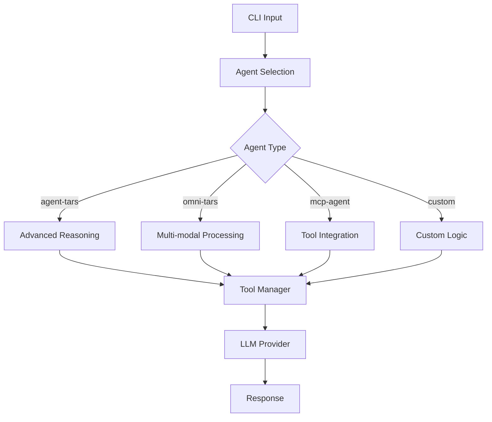

# Built-in Agents

Tarko CLI 包含三个内置 Agent，可以直接使用。

## 可用的 Agent

### `agent-tars`

高级任务自动化和推理系统。

```bash
# 启动 Web UI
tarko run agent-tars

# 无头模式
tarko run agent-tars --headless --input "分析当前目录结构"

# 服务器模式
tarko serve agent-tars
```

### `omni-tars`

多模态 Agent，支持文本、图像、文件处理。

```bash
# 启动 Web UI
tarko run omni-tars

# 无头模式
tarko run omni-tars --headless --input "分析这个图片"

# 服务器模式
tarko serve omni-tars
```

### `mcp-agent`

**Model Context Protocol** Agent，专门用于 Tool 集成。

```bash
# 启动 Web UI
tarko run mcp-agent

# 无头模式
tarko run mcp-agent --headless --input "列出所有可用工具"

# 服务器模式
tarko serve mcp-agent
```

## 使用自定义 Agent

除了内置 Agent，你也可以创建自定义 Agent：

```typescript
// my-agent.ts
import { Agent } from '@tarko/agent';

class MyAgent extends Agent {
  constructor(options = {}) {
    super({
      ...options,
      name: 'MyAgent',
      instructions: '你是一个专门的助手...'
    });
  }
}

export default MyAgent;
```

使用自定义 Agent：

```bash
# 运行自定义 Agent
tarko run ./my-agent.ts

# 部署自定义 Agent
tarko serve ./my-agent.ts
```

## Agent 架构



## 配置 Agent

在 `tarko.config.ts` 中配置默认 Agent：

```typescript
import { AgentAppConfig } from '@tarko/interface';

const config: AgentAppConfig = {
  model: {
    provider: 'openai',
    id: 'gpt-4'
  },
  tool: {
    include: ['file_*', 'web_*']
  }
};

export default config;
```

## 下一步

- [CLI Commands](/guide/cli/commands) - 完整命令参考
- [Configuration](/guide/cli/configuration) - 配置选项
- [Tool Integration](/guide/basic/tool-call-engine) - 添加自定义 Tool
