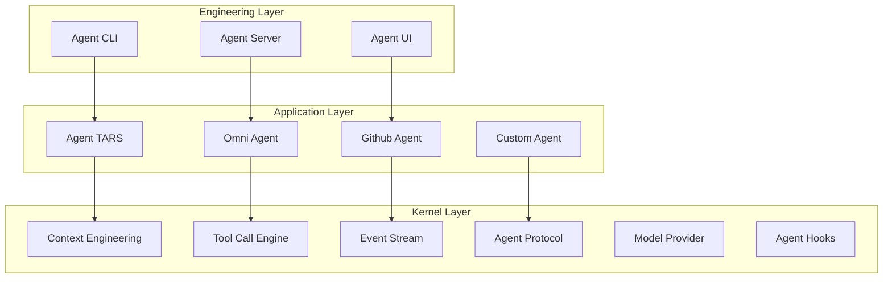

# Architecture

Tarko is designed with a clean three-layer architecture that separates concerns and enables flexible agent development.

## Overview



## 1. Engineering Layer

The engineering layer provides production-ready solutions for deploying Tarko-based agents.

### Agent CLI (`@tarko/agent-cli`)

**Purpose**: One-click agent development and deployment

**Use Cases**:
- Development: `tarko run [agent]` for local development
- Production: One-click deployment to production environments

**Example**:
```bash
# Development
tarko run my-agent.ts

# Production deployment
tarko deploy my-agent.ts --platform tars
```

### Agent Server (`@tarko/agent-server`)

**Purpose**: Node.js API for custom server integrations

**Use Cases**:
- Custom user authentication
- Custom storage solutions
- Integration with existing systems

**Example**:
```typescript
import { AgentServer } from '@tarko/agent-server';

const server = new AgentServer({
  agent: myAgent,
  auth: customAuthProvider,
  storage: customStorageProvider
});

server.listen(3000);
```

### Agent UI (`@tarko/agent-ui`)

**Purpose**: Official web UI for Tarko Agent Protocol

**Customization Levels**:
- **L1**: Static configuration (most scenarios)
- **L2**: UI SDK-based development
- **L3**: Build from scratch

## 2. Application Layer

The application layer contains Tarko-based agent implementations for specific use cases.

### Agent TARS
**Purpose**: Open-source general-purpose multimodal agent
**Capabilities**: Browser automation, file system, command execution, search, MCP

### Omni Agent
**Purpose**: UI-TARS-2 specialized multimodal agent
**Capabilities**: Same as Agent TARS but optimized for Seed Agent integration

### Github Agent
**Purpose**: Git workflow and coding agent
**Capabilities**: Github workflow, code search, code generation, command execution

### Custom Agents
Developers can build custom agents using the Tarko kernel while maintaining compatibility with the engineering layer.

## 3. Kernel Layer

The kernel layer solves core agent runtime challenges.

### Context Engineering

**Problem**: Building agents capable of long-running operations
**Solution**: Advanced context management with automatic optimization

**Features**:
- Automatic context compression
- Intelligent context windowing
- State persistence across sessions
- Memory optimization

### Tool Call Engine

**Problem**: Different LLM providers have varying Tool Call support
**Solution**: Unified interface following OpenAI Function Call protocol

**Supported Engines**:
- Native Function Call (OpenAI, Anthropic)
- Custom parsers (Seed-1.5 VL)
- Prompt Engineering (Kor-based)

### Event Stream

**Problem**: Standard communication between agent components
**Solution**: Unified event stream protocol

**Benefits**:
- Real-time agent state updates
- Standardized debugging and monitoring
- Easy UI integration

### Agent Protocol

**Problem**: Inconsistent agent interfaces
**Solution**: Standard protocol definitions

**Components**:
- **Event Stream**: Internal component communication
- **Server Protocol**: HTTP/SSE/WebSocket APIs

### Model Provider

**Design**: OpenAI Compatible protocol
**Supported Providers**: Volcengine, OpenAI, Anthropic, Gemini

**Benefits**:
- Consistent interface across providers
- Easy model switching for testing
- Reduced architectural complexity

### Agent Hooks

**Purpose**: Extensible customization points
**Use Cases**: Custom logging, monitoring, behavior modification

## Design Principles

### 1. Separation of Concerns
Each layer has clear responsibilities and minimal dependencies on other layers.

### 2. Protocol-First Design
Standardized protocols enable interoperability and tooling ecosystem.

### 3. OpenAI Compatibility
Leveraging existing standards reduces learning curve and increases compatibility.

### 4. Extensibility
Hooks and protocols allow customization without core modifications.

## Integration Points

### Agent Development
```typescript
import { Agent } from '@tarko/agent';

// Application Layer
const myAgent = new Agent({
  // Kernel Layer integration
  contextEngineering: { /* config */ },
  toolCallEngine: { /* config */ },
  hooks: { /* custom hooks */ }
});

// Engineering Layer consumption
export default myAgent;
```

### Production Deployment
```bash
# Engineering Layer handles deployment
tarko run my-agent.ts --production
```

## Next Steps

- [Context Engineering](/guide/advanced/context-engineering) - Deep dive into context management
- [Tool Call Engine](/guide/basic/tool-call-engine) - Learn about tool integration
- [Agent Protocol](/guide/advanced/agent-protocol) - Understand communication standards
