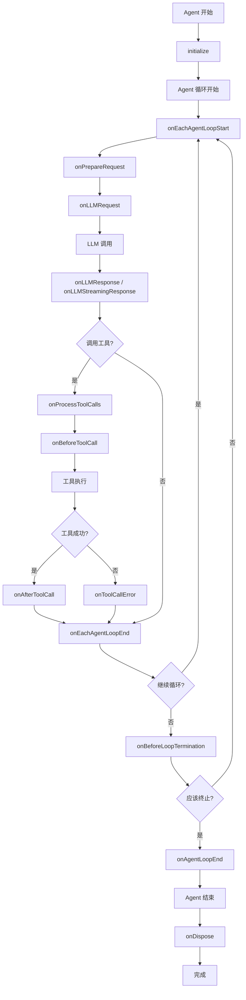

# Agent Hooks

## 简介

Agent Hooks 提供了一种强大的方式来扩展和自定义 Agent 在整个执行生命周期中的行为。`BaseAgent` 类公开了一套全面的钩子，允许您拦截、修改和响应 Agent 执行期间的各种事件。

## 概览

| 钩子 | 描述 |
|------|------|
| [`initialize()`](#initialize) | Agent 初始化时调用 |
| [`onDispose()`](#ondispose) | Agent 销毁时调用 |
| [`onPrepareRequest()`](#onpreparerequest) | 准备 LLM 请求前调用 |
| [`onLLMRequest()`](#onllmrequest) | 发送请求到 LLM 前调用 |
| [`onLLMResponse()`](#onllmresponse) | 从 LLM 接收响应后调用 |
| [`onLLMStreamingResponse()`](#onllmstreamingresponse) | LLM 流式响应时调用 |
| [`onProcessToolCalls()`](#onprocesstoolcalls) | 拦截工具调用处理 |
| [`onBeforeToolCall()`](#onbeforetoolcall) | 执行工具前调用 |
| [`onAfterToolCall()`](#onaftertoolcall) | 执行工具后调用 |
| [`onToolCallError()`](#ontooolcallerror) | 工具执行失败时调用 |
| [`onEachAgentLoopStart()`](#oneachagentloopstart) | 每次 Agent 循环开始时调用 |
| [`onEachAgentLoopEnd()`](#oneachagentloopend) | 每次 Agent 循环结束时调用 |
| [`onBeforeLoopTermination()`](#onbeforelooptermination) | Agent 循环终止前调用 |
| [`onAgentLoopEnd()`](#onagentloopend) | 整个 Agent 循环完成时调用 |

## 基本示例

### `initialize()`

Agent 初始化期间调用，用于执行设置操作。

```ts
class CustomAgent extends BaseAgent {
  async initialize(): Promise<void> {
    // 执行耗时的设置操作
    await this.connectToDatabase();
    await this.loadConfiguration();
    console.log('Agent 初始化成功');
  }
}
```

### `onDispose()`

Agent 销毁期间调用，用于清理资源。

```ts
class CustomAgent extends BaseAgent {
  protected async onDispose(): Promise<void> {
    // 清理资源
    await this.closeConnections();
    this.clearTimers();
    console.log('Agent 销毁成功');
  }
}
```

### `onPrepareRequest()`

准备 LLM 请求前调用，允许动态修改系统提示和工具。

```ts
class CustomAgent extends BaseAgent {
  onPrepareRequest(context: PrepareRequestContext): PrepareRequestResult {
    let { systemPrompt, tools } = context;
    
    // 根据上下文修改系统提示
    if (context.iteration > 3) {
      systemPrompt += '\n\n注意：您正在第 ' + context.iteration + 
        ' 次迭代中。请专注于提供简洁的最终答案。';
    }
    
    // 根据当前状态过滤工具
    const filteredTools = tools.filter(tool => {
      // 在后期迭代中禁用昂贵的工具
      if (context.iteration > 5 && tool.name.includes('search')) {
        return false;
      }
      return true;
    });
    
    return {
      systemPrompt,
      tools: filteredTools,
    };
  }
}
```

### `onLLMRequest()`

向 LLM 发送请求前触发，允许您检查或记录请求负载。

```ts
class CustomAgent extends BaseAgent {
  async onLLMRequest(id: string, payload: LLMRequestHookPayload): Promise<void> {
    console.log(`向 LLM 发送请求，会话 ${id}`);
    console.log(`模型: ${payload.model}`);
    console.log(`消息数量: ${payload.messages.length}`);
    
    // 记录令牌使用情况以进行监控
    this.logTokenUsage(payload);
  }
}
```

### `onBeforeToolCall()`

执行工具前调用，允许您修改参数或添加验证。

```ts
class CustomAgent extends BaseAgent {
  async onBeforeToolCall(
    id: string,
    toolCall: { toolCallId: string; name: string },
    args: any
  ): Promise<any> {
    console.log(`执行工具: ${toolCall.name}`);
    
    // 添加验证
    if (toolCall.name === 'fileOperation' && !this.hasFilePermission()) {
      throw new Error('文件操作权限不足');
    }
    
    // 修改参数
    if (toolCall.name === 'searchWeb') {
      args.maxResults = Math.min(args.maxResults || 10, 5);
    }
    
    return args;
  }
}
```

### `onAfterToolCall()`

执行工具后调用，允许您修改结果或添加后处理。

```ts
class CustomAgent extends BaseAgent {
  async onAfterToolCall(
    id: string,
    toolCall: { toolCallId: string; name: string },
    result: any
  ): Promise<any> {
    console.log(`工具 ${toolCall.name} 执行完成`);
    
    // 后处理结果
    if (toolCall.name === 'imageAnalysis') {
      result.confidence = this.calculateConfidence(result);
    }
    
    // 记录工具使用情况
    this.logToolUsage(toolCall.name, result);
    
    return result;
  }
}
```

### `onToolCallError()`

工具执行导致错误时调用，允许您处理或转换错误。

```ts
class CustomAgent extends BaseAgent {
  async onToolCallError(
    id: string,
    toolCall: { toolCallId: string; name: string },
    error: any
  ): Promise<any> {
    console.error(`工具 ${toolCall.name} 执行失败:`, error);
    
    // 提供备用响应
    if (toolCall.name === 'weatherAPI') {
      return '天气信息当前不可用，请稍后再试。';
    }
    
    // 转换错误消息
    if (error.code === 'RATE_LIMIT') {
      return '服务暂时繁忙，请稍等片刻后重试。';
    }
    
    return `错误: ${error.message || error}`;
  }
}
```

## 钩子执行顺序



## 即将推出

详细的 Hooks API 文档正在完善中，敬请期待：

- 完整的钩子接口定义
- 上下文对象详细说明
- 钩子组合模式
- 插件架构指南
- 自定义钩子开发

目前请参考 [英文版 Hooks API 文档](/api/hooks) 了解完整信息。
