# TARS 项目总体架构图

```mermaid
graph TB
    %% User Interface Layer
    subgraph UI["User Interface Layer"]
        CLI["Agent TARS CLI"]
        WebUI["Agent TARS Web UI"]
        Desktop["UI-TARS Desktop"]
    end

    %% Product Layer
    subgraph PL["Product Layer"]
        subgraph AT["Agent TARS"]
            AT_Core["Agent TARS Core"]
            AT_Browser["Browser Agent"]
            AT_MCP["MCP Integration"]
        end

        subgraph UT["UI-TARS Desktop"]
            UT_Local["Local Computer Operator"]
            UT_Remote["Remote Computer Operator"]
            UT_Browser["Browser Operator"]
        end
    end

    %% Core Services Layer
    subgraph CS["Core Services Layer"]
        subgraph MCP["MCP Infrastructure"]
            MCP_Client["mcp-client"]
            MCP_Servers["MCP Servers"]
            MCP_HTTP["mcp-http-server"]
        end

        subgraph SDK_Group["UI-TARS SDK"]
            SDK["@ui-tars/sdk"]
            ActionParser["action-parser"]
            Shared["shared"]
        end
    end

    %% Operators Layer
    subgraph OL["Operators Layer"]
        NutJS["nut-js Operator"]
        ADB["ADB Operator"]
        BrowserOp["Browser Operator"]
        Browserbase["Browserbase Operator"]
    end

    %% AI Models Layer
    subgraph AI["AI Models Layer"]
        VLM["Vision-Language Models"]
        UITARS["UI-TARS Models"]
    end

    %% Platform Layer
    subgraph Platform["Platform Layer"]
        Desktop_OS["Desktop OS"]
        Mobile_OS["Mobile OS"]
        Web_Browser["Web Browsers"]
        Cloud_VM["Cloud VMs"]
    end

    %% Connections
    CLI --> AT_Core
    WebUI --> AT_Core
    Desktop --> UT_Local
    Desktop --> UT_Remote
    Desktop --> UT_Browser

    AT_Core --> MCP_Client
    AT_Browser --> BrowserOp
    AT_MCP --> MCP_Servers

    UT_Local --> SDK
    UT_Remote --> SDK
    UT_Browser --> SDK

    SDK --> ActionParser
    SDK --> Shared
    MCP_Client --> MCP_Servers
    MCP_Servers --> MCP_HTTP

    SDK --> NutJS
    SDK --> ADB
    SDK --> BrowserOp
    SDK --> Browserbase

    AT_Core --> VLM
    SDK --> UITARS
    ActionParser --> UITARS

    NutJS --> Desktop_OS
    ADB --> Mobile_OS
    BrowserOp --> Web_Browser
    Browserbase --> Cloud_VM

    %% Styling
    classDef userLayer fill:#e1f5fe,stroke:#01579b,stroke-width:2px
    classDef productLayer fill:#f3e5f5,stroke:#4a148c,stroke-width:2px
    classDef coreLayer fill:#e8f5e8,stroke:#1b5e20,stroke-width:2px
    classDef operatorLayer fill:#fff3e0,stroke:#e65100,stroke-width:2px
    classDef aiLayer fill:#fce4ec,stroke:#880e4f,stroke-width:2px
    classDef platformLayer fill:#f1f8e9,stroke:#33691e,stroke-width:2px

    class CLI,WebUI,Desktop userLayer
    class AT_Core,AT_Browser,AT_MCP,UT_Local,UT_Remote,UT_Browser productLayer
    class MCP_Client,MCP_Servers,MCP_HTTP,SDK,ActionParser,Shared coreLayer
    class NutJS,ADB,BrowserOp,Browserbase operatorLayer
    class VLM,UITARS aiLayer
    class Desktop_OS,Mobile_OS,Web_Browser,Cloud_VM platformLayer
```

## 🏗️ 架构层次说明

### 1. 用户界面层 (User Interface Layer)

- **Agent TARS CLI**: 命令行工具，支持 headless 和 headful 模式
- **Agent TARS Web UI**: 基于浏览器的图形界面
- **UI-TARS Desktop**: Electron 桌面应用程序

### 2. 产品层 (Product Layer)

- **Agent TARS**: 通用多模态 AI Agent 栈
  - 浏览器代理 (GUI + DOM 混合策略)
  - MCP 集成 (连接真实世界工具)
- **UI-TARS Desktop**: 专门的 GUI 代理
  - 本地计算机操作器
  - 远程计算机操作器
  - 浏览器操作器

### 3. 核心服务层 (Core Services Layer)

- **MCP 基础设施**: Model Context Protocol 实现
- **UI-TARS SDK**: 跨平台 GUI 自动化工具包
- **动作解析器**: 理解和解析用户意图

### 4. 操作器层 (Operators Layer)

- **nut-js**: 桌面系统控制
- **ADB**: Android 设备控制
- **Browser**: 浏览器控制
- **Browserbase**: 云浏览器控制

### 5. AI 模型层 (AI Models Layer)

- **通用 VLM**: Claude-3.5, GPT-4V, Doubao 等
- **专用模型**: UI-TARS-1.5/1.6 专门的 GUI 模型

### 6. 平台层 (Platform Layer)

- 支持多种操作系统和设备平台

## 🔄 数据流向

1. **用户输入** → 用户界面层
2. **意图理解** → AI 模型层处理自然语言
3. **动作规划** → 核心服务层解析和规划
4. **平台执行** → 操作器层执行具体操作
5. **反馈循环** → 实时状态反馈给用户

## 🎯 核心特性

- **多模态**: 结合视觉和语言理解
- **跨平台**: 支持桌面、移动、Web 多平台
- **可扩展**: 通过 MCP 协议轻松扩展功能
- **本地+云端**: 支持本地和远程操作模式
- **实时反馈**: 提供实时操作状态和结果反馈
